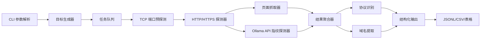
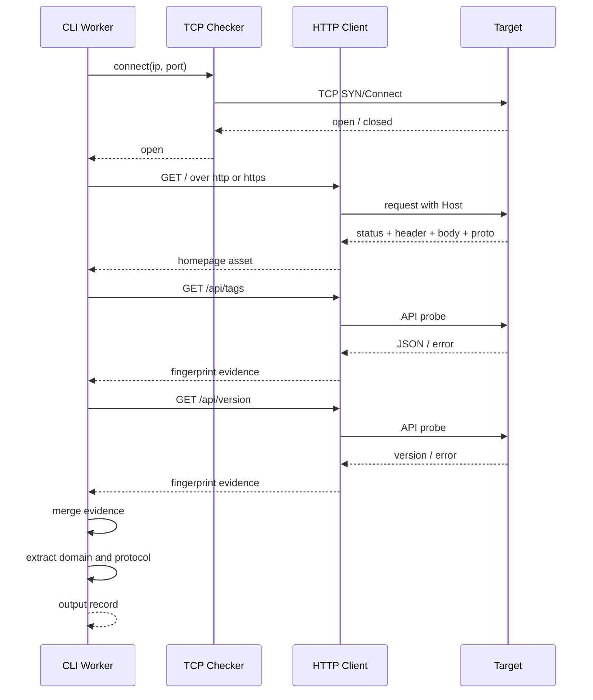
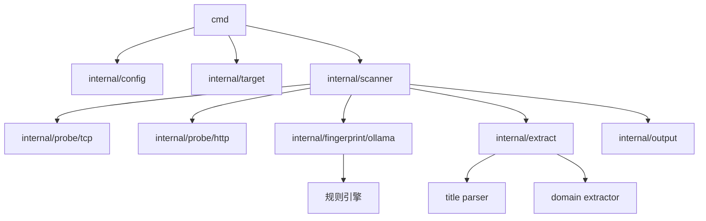

# Ollama 网站测绘 CLI 需求设计

## 1. 目标

开发一个使用 Golang 编写的网站测绘 CLI 程序。程序输入 `IP 网段` 与 `端口范围`，输出该范围内可识别为 `Ollama 服务网站资产` 的探测结果。

输出结果至少包含以下字段：

- `ip`
- `port`
- `host`
- `domain`
- `body`
- `header`

为降低误报并提高可用性，设计中建议额外输出：

- `scheme`
- `url`
- `status_code`
- `protocol`
- `title`
- `fingerprint`
- `confidence`
- `tls`

## 2. 需求解释与边界

### 2.1 输入

- 支持 CIDR 网段，例如 `192.168.1.0/24`
- 支持单个 IP，例如 `10.0.0.5`
- 支持端口范围，例如 `80,443,8080,11434-11440`
- 支持并发数、超时、输出格式、输出文件等常见 CLI 参数

### 2.2 输出对象

本工具输出的是“对外可识别为 Ollama 服务的网站资产”，而不是限定为“原生裸 Ollama 进程”。  
这意味着以下场景都应视为有效目标：

- 直接暴露的 Ollama HTTP 服务
- 通过 Nginx/Caddy/Traefik 等反向代理暴露的 Ollama 服务
- 协议层表现为 HTTP/1.0 或 HTTP/2，但业务层可识别为 Ollama 的网站资产

### 2.3 字段定义

- `ip`: 最终连接目标 IP
- `port`: 最终连接目标端口
- `host`: 本次 HTTP 请求实际使用的 Host 值。默认情况下为 `ip:port`；若后续支持字典域名探测，则为具体域名
- `domain`: 从探测过程中提取出的域名列表，来源包括：
  - 反向 DNS
  - TLS 证书 SAN / CN
  - HTTP 3xx `Location`
  - 页面内绝对 URL
- `body`: 截断后的响应体摘要，默认保留前 N KB
- `header`: 响应头原始键值

## 3. 关键实现注意点

### 3.1 误报控制

不能仅凭以下单一条件判断为 Ollama：

- 端口是 `11434`
- 页面含有 `Ollama` 字样
- 某个 Header 中出现类似字符串

建议采用“多特征加权匹配”：

1. 高置信度特征
   - `GET /api/tags` 返回 JSON，结构符合 Ollama 模型列表特征
   - `GET /api/version` 返回合法版本信息
   - `POST /api/generate`、`POST /api/chat` 返回格式符合 Ollama API 规范
2. 中置信度特征
   - 页面标题、页面正文、错误页、代理页中出现稳定 Ollama 标识
   - 常见路径如 `/`, `/api/tags`, `/api/version` 的组合响应特征匹配
3. 低置信度特征
   - 端口、Server Header、favicon hash、页面文案

最终应给出 `fingerprint` 与 `confidence`，并允许用户配置严格模式。

### 3.2 协议识别

需求要求验证数据集中包含 `HTTP/1.0` 和 `HTTP/2.0` 的 Ollama 服务网站，因此探测结果中必须记录实际使用协议：

- `HTTP/1.0`
- `HTTP/1.1`
- `HTTP/2.0`

协议识别建议以 Go `http.Response.Proto` 为准。  
对 HTTPS 目标，需要启用 ALPN，以便识别 `h2`。  
对 HTTP 明文目标，默认不强求 `h2c`，除非后续明确扩展。

### 3.3 Host 与 Domain 的语义

如果输入只有 IP 网段，则 `host` 和 `domain` 很容易被混用。设计中将两者明确拆分：

- `host` 记录请求时使用的 Host
- `domain` 记录探测阶段额外发现的域名

这样即使只给 IP，也能稳定输出结构化结果。

### 3.4 页面抓取与 API 探测平衡

资产测绘不仅要识别 API，也要保留“网站资产”信息。因此建议同时执行两类探测：

- 页面探测：`/`
- API 探测：`/api/tags`、`/api/version`

页面探测负责输出 `body`、`header`、`title` 等网站资产字段。  
API 探测负责提升 Ollama 指纹识别准确率。

### 3.5 扫描性能与资源控制

网段和端口范围组合容易形成大量任务。需要在设计中提前约束：

- 可配置 worker 并发
- 连接超时、读取超时、总请求超时
- 每个目标最大请求次数
- Body 截断上限
- 全局速率限制
- 失败重试策略

否则 CLI 在大网段上容易出现句柄耗尽、扫描过慢或被目标封禁的问题。

### 3.6 法律与安全边界

该工具用于网站资产测绘。设计文档中应明确：

- 仅用于授权范围内的资产发现与验证
- 默认不执行破坏性请求
- 仅发送识别所需的最小 HTTP 请求

## 4. 推荐方案与备选方案

### 4.1 推荐方案：TCP 预探测 + HTTP 双阶段识别

核心思路：

1. 先做 TCP connect，过滤未开放端口
2. 对开放端口按 `http` 和 `https` 进行轻量 HTTP 探测
3. 同步抓取页面与 API 指纹
4. 聚合结果并输出结构化资产

优点：

- 性能和准确率平衡较好
- 适合做并发扫描
- 容易记录协议、Header、Body、域名信息
- 容易扩展到更多指纹规则

缺点：

- 比“只打一条请求”复杂
- 需要管理超时、重试、协议回退

### 4.2 备选方案 A：只依赖 API 探测

只探测 `/api/tags`、`/api/version`。

优点：

- 实现简单
- 对 Ollama 原生服务识别准确率高

缺点：

- 无法稳定输出完整网站资产字段
- 对反向代理或定制前端不友好
- 容易漏掉首页特征明显但 API 受限的目标

### 4.3 备选方案 B：只做页面关键字匹配

优点：

- 最容易实现

缺点：

- 误报极高
- 无法满足稳定指纹要求
- 很难支撑 HTTP/1.0 与 HTTP/2.0 的验证结论

### 4.4 结论

推荐采用“TCP 预探测 + HTTP 双阶段识别”的方案。

## 5. 系统设计图

### 5.1 总体架构图



### 5.2 单目标探测时序图



### 5.3 模块拆分图



## 6. 数据流设计

1. 用户传入 CIDR 与端口范围
2. 目标生成器展开为 `(ip, port)` 列表
3. TCP 探针先过滤掉不可达端口
4. 对开放端口分别尝试：
   - `http://ip:port/`
   - `https://ip:port/`
5. 记录首个成功页面响应
6. 继续探测 `/api/tags` 与 `/api/version`
7. 汇总 Header、Body、标题、协议、域名线索
8. 执行 Ollama 指纹判定并打分
9. 只输出命中阈值的记录

## 7. 输出格式设计

建议默认输出 `JSONL`，因为：

- 适合大规模扫描流式写出
- 易于后续管道处理
- 保留复杂字段结构更自然

示例：

```json
{
  "ip": "192.168.1.10",
  "port": 11434,
  "scheme": "https",
  "url": "https://192.168.1.10:11434/",
  "host": "192.168.1.10:11434",
  "domain": [
    "ollama.lab.local"
  ],
  "status_code": 200,
  "protocol": "HTTP/2.0",
  "title": "Ollama",
  "header": {
    "content-type": [
      "text/html; charset=utf-8"
    ]
  },
  "body": "<html>...</html>",
  "fingerprint": [
    "homepage_keyword:ollama",
    "api_tags_json",
    "api_version_ok"
  ],
  "confidence": "high",
  "tls": true
}
```

## 8. 验证数据集设计

### 8.1 目标

验证数据集中必须至少包含以下样本：

- 一个可识别为 Ollama 的 `HTTP/1.0` 网站资产
- 一个可识别为 Ollama 的 `HTTP/2.0` 网站资产
- 若干非 Ollama 对照样本

### 8.2 设计原则

由于“原生 Ollama”未必天然对外提供 `HTTP/1.0` 与 `HTTP/2.0` 两种协议形态，因此测试数据集应面向“对外表现为 Ollama 服务资产”的目标，而不是限定某个部署方式。

### 8.3 推荐数据集构成

1. `sample-http10`
   - 使用 Go 自定义测试服务或轻量代理
   - 对外返回 `HTTP/1.0`
   - 页面或 API 具备 Ollama 指纹
2. `sample-http20`
   - 使用支持 ALPN `h2` 的 HTTPS 服务
   - 对外返回 `HTTP/2.0`
   - 页面或 API 具备 Ollama 指纹
3. `sample-negative-nginx`
   - 普通 Nginx 欢迎页
4. `sample-negative-json-api`
   - 普通 JSON API，不含 Ollama 特征

### 8.4 数据集输出要求

验证结果中必须能明确看到：

- `protocol=HTTP/1.0` 的 Ollama 命中样本
- `protocol=HTTP/2.0` 的 Ollama 命中样本

## 9. 错误处理设计

- TCP 连接失败：记录为跳过，不进入 HTTP 探测
- TLS 握手失败：若用户允许回退，则尝试明文 HTTP
- 页面抓取失败但 API 成功：仍可判定为 Ollama 资产，但 `body` 为空或降级
- 页面成功但 API 失败：若页面特征不足，不应高置信度命中
- Body 过大：截断并标记 `truncated=true`

## 10. 测试设计

### 10.1 单元测试

- CIDR 展开
- 端口范围解析
- Ollama 指纹规则匹配
- 域名提取
- Body 截断
- 协议字段解析

### 10.2 集成测试

- 扫描本地模拟 HTTP/1.0 Ollama 样本
- 扫描本地模拟 HTTP/2.0 Ollama 样本
- 扫描非 Ollama 样本，验证不误报

### 10.3 回归测试重点

- 反向代理场景
- 自签名证书场景
- 首页 200 但 API 403/404 场景
- API 命中但首页为错误页场景

## 11. 建议的 CLI 形态

示例命令：

```bash
ollama-map scan \
  --cidr 192.168.1.0/24 \
  --ports 80,443,8080,11434-11440 \
  --concurrency 200 \
  --timeout 3s \
  --format jsonl \
  --output result.jsonl
```

建议参数：

- `--cidr`
- `--ports`
- `--concurrency`
- `--timeout`
- `--insecure`
- `--body-limit`
- `--format`
- `--output`
- `--min-confidence`

## 12. 后续实现建议

实现阶段建议按以下顺序推进：

1. CLI 参数与输入解析
2. 目标生成与并发调度
3. TCP 预探测
4. HTTP 页面抓取
5. Ollama 指纹识别
6. 输出模块
7. HTTP/1.0 与 HTTP/2.0 验证数据集

## 13. 本次设计结论

该 CLI 的核心不是“扫到 11434 端口就算 Ollama”，而是：

- 从 IP 网段和端口范围中并发发现网站资产
- 识别实际 HTTP 协议版本
- 通过页面与 API 多特征联合判断 Ollama
- 输出结构化、可落盘、可验证的数据结果

其中，`HTTP/1.0` 和 `HTTP/2.0` 的数据集要求，需要在实现阶段通过可控测试样本明确构建，不应依赖不稳定的外部环境。
